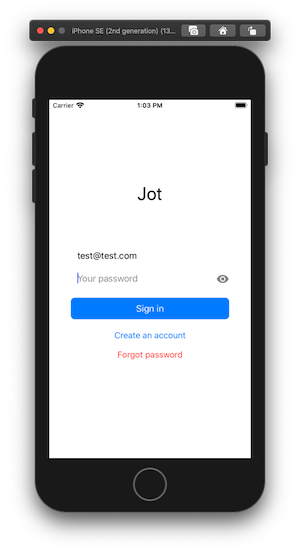
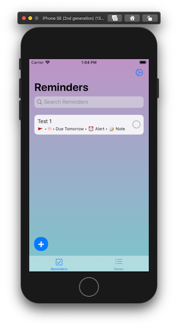
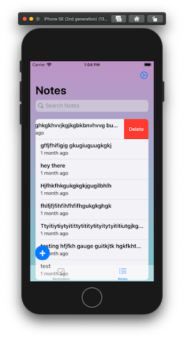
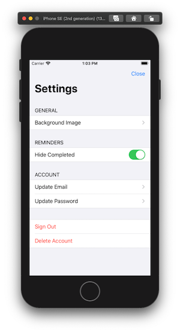
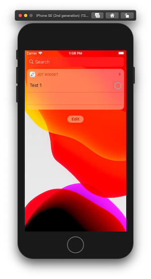
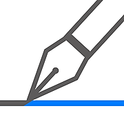

# Jot Package

# Overview

This is a personal project of mine for taking notes and setting reminders on the
iOS platform. It combines my favourite features of [Microsoft's To-Do](https://todo.microsoft.com/)
and [Apple's Reminders](https://www.apple.com/ca/ios) apps. This was built off
existing work done from a seperate private repo; the way I had setup the project
made it very difficult to add widgets and extensions... and so Jot Package was
born. 

| | | |
|:-------------------------:|:-------------------------:|:-------------------------:|
| Permission Alert |   Splash Screen | Create Account |
| Login |   Reminders | Edit Reminder |
| Notes |   Notes Info | Edit Note |
| Settings |   Widget ||

## Features

- **Reminders**
    - [x] Title, due date, alerts, priority, flags, notes
- **Notes**
    - [x] Markdown, info tool
- [x] Search functionality of notes and reminders
- [x] iOS Widget
- [x] Notification badges when reminders due
- [x] Firebase secure authentication and Firestore database
- [x] Custom background images on Reminders and Notes tabs

## Requirements 

- iOS 13
- Xcode 11

## Installation

### CocoaPods
We use [CocoaPods](http://cocoapods.org/) to install our dependencies defined in our `Podfile`:

```bash
sudo gem install cocoapods
cd <project-root>
pod init
pod install
```

For more info on project setup visit the [Wiki](https://github.com/NiroshR/JotPackage/wiki/Project-Setup).

## Author
Nirosh Ratnarajah. Literally just me... and StackOverflow.

